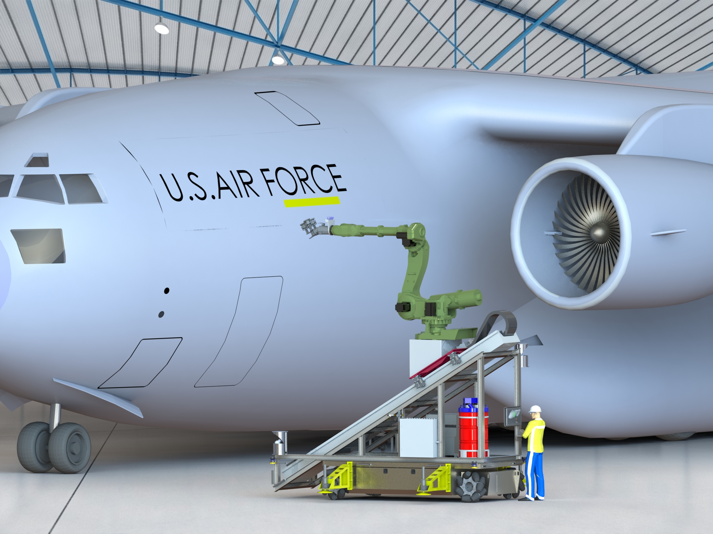

#A5

##Advanced Automation for Agile Aerospace Applications

The A5 program is a four year effort, sponsored by the Air Force Research Lab, to enable agile and flexible automation for critical Air Force sustainment needs.  The development team is led by the National Center for Defense Manufacturing and Machining (NCDMM) with contributions from The Boeing Company and Southwest Research Institute (SwRI).  The program leverages the advanced capabilities of ROS to provide a platform to rapidly deploy automation solutions that are adaptable wide variety of tasks and operating environments.

[Press Release](http://www.swri.org/9what/releases/2016/aerospace-manufacturing-automation.htm)